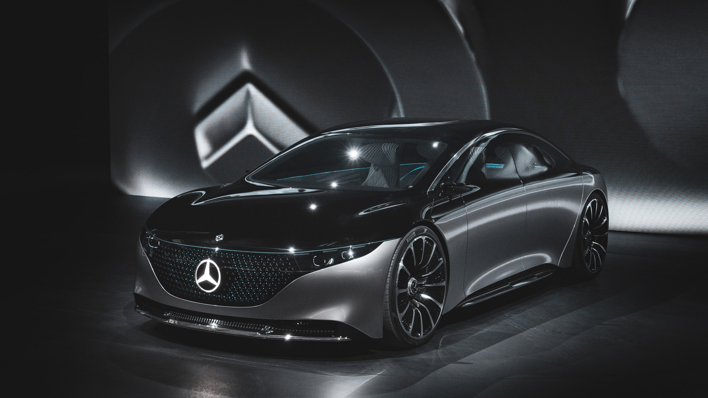

# Fully Electric

Fully Electric is a marketplace for electric vehicles where sellers can list their cars and be contacted by interested buyers - find more at [fully-electric.herokuapp.com/](https://fully-electric.herokuapp.com/)

## Screenshots


## Installation and getting it started
To run the app please follow these instructions:

1. Clone this repo
```bash
git clone https://github.com/goncalog/fully-electric.git
cd fully-electric
```

2. Back-end server: Install dependencies and start it

In the root project folder *fully-electric*:
```bash
cd fully-electric-backend
npm install
npm run serverstart
```

3. Front-end client: Install dependencies and start it

In the root project folder *fully-electric*:
```bash
cd fully-electric-frontend
npm install
npm start
```

## Tech stack
- Backend (API)
    - Node.js
    - Express.js
- Frontend
    - React.js
    - JavaScript
    - HTML
    - CSS
- Database
    - MongoDB
    - Mongoose
- Testing (Test Driven Development)
    - Mocha
    - Jest
